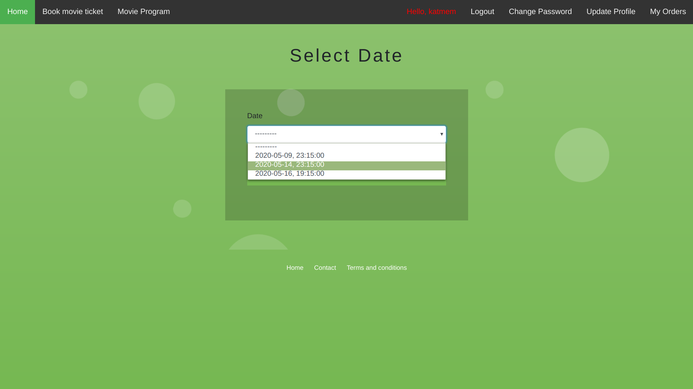

# Ticket Please - A web application for booking movie tickets
This application was developed with Django, MongoDB, HTML and CSS. It allows users to either search for a movie and find the theaters where the movie is currently playing or search for a theater of their choice and view the movies that are playing in that specific theater. After they choose their preferred movie and theater, they can choose a date at which they would like to book tickets for, and select seats. Then, they can complete their order by paying by card.
 
## Screenshots

Homepage

When users click on a movie, they can see information about it

When unauthenticated users click "Book movie ticket", they are redirected to this page where they are asked to sign up or login

Sign up

Login

Users can either select a movie and view the theaters where the movie is playing or select a theater and view the movies playing at it

Movie selection

List of theaters where the selected movie is playing

Theater selection

List of movies that are playing in the selected theater

Date selection

Seat selection page before user's seat reservation (Seat 4,1 is already reserved by another user)

User selects seats 1,1 and 1,2

Seat selection page after user's seat reservation (Seats 1,1 and 1,2 are now red as they have been reserved by the user)

Payment

After the payment, the user is redirected to a booking confirmation page that displays the booked tickets

Users can view their order history by clicking "My Orders" on the right

The website visitors can view the movies schedule of all theaters by clicking "Movie Program"

Users can update their profile information

Users can also update their password

